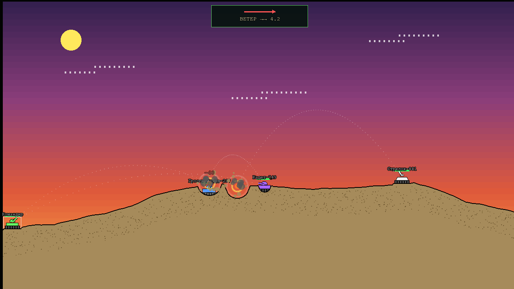

# Burned Ground - Танки (Artillery-style)

Пошаговая артиллерийская стратегия с разрушаемым ландшафтом в стиле DOS.



*Закатная карта, попадание Heavy Missile по «Гроссмейстеру»: осыпающийся кратер,
дымный след прошлых выстрелов и индикатор ветра со стрелкой сноса.*

## Запуск

```bash
# Установка зависимостей
npm install

# Запуск сервера
npm start
```

Откройте http://localhost:3000 в браузере.

Для тестов можно переопределять параметры через env:
`BG_MIN_PLAYERS`, `BG_ROUNDS`, `BG_TURN_MS`, `BG_RECONNECT_MS`, `PORT`.

## Аккаунты

Играть можно и без регистрации — гость помечается в списке игроков и не влияет
на статистику. Аккаунт даёт постоянный профиль и запись матчей.

- Позывной авторизованного игрока **берётся из аккаунта**: занять чужое имя в лобби нельзя.
- Токен сессии живёт 30 дней, «ВЫЙТИ» отзывает его на сервере (`POST /api/auth/logout`).
- Вход и регистрация ограничены: 10 попыток за 15 минут на пару адрес+логин.
- Место в матче защищено секретом сессии: знания кода комнаты и `playerId`
  (он виден всем) недостаточно, чтобы занять чужой танк. Владелец аккаунта
  дополнительно может вернуться в бой с другого устройства, просто войдя под своим логином.

За реверс-прокси задайте `BG_TRUST_PROXY=1` — иначе все игроки приходят с адреса
прокси и лимит попыток входа становится общим на всех.

## Рейтинг

Elo, стартовое значение 1000, K=32.

- **Рейтинговым** считается матч, где минимум **два игрока с аккаунтами**.
  Матчи против ботов идут в общую статистику и историю, но рейтинг не двигают —
  иначе его фармят лёгкими ботами.
- Места в матче: сначала **победы в раундах**, затем убийства, затем заработок.
  Одинаковые показатели делят место.
- В матче на несколько человек рейтинг считается попарно и делится на число
  соперников, чтобы матч на восьмерых не качал сильнее дуэли.
- Победа над ботом не засчитывается победой в матче: если первое место занял бот,
  победителя среди людей нет.

Состав каждого матча сохраняется целиком (включая ботов и гостей), поэтому
в истории профиля видно, с кем именно играли.

| Эндпоинт | Что отдаёт |
|----------|------------|
| `GET /api/me` | профиль, статистика и последние 10 матчей (по токену) |
| `GET /api/profile/:username` | публичный профиль с историей |
| `GET /api/stats/:username` | только агрегированная статистика |
| `GET /api/leaderboard?limit=50` | таблица лидеров по Elo |
| `GET /api/rooms` | список публичных комнат для лобби |
| `GET /api/health` | аптайм, число комнат и соединений (для мониторинга) |

## Управление

- **Стрелки ←→** - угол выстрела: стрелка ведет ствол в свою сторону
  (0° = влево, 90° = вверх, 180° = вправо)
- **Стрелки ↑↓** - мощность
- **SHIFT + стрелки** - шаг 10 вместо 1
- **Числовой ввод** - угол и мощность можно набрать числом; Enter применяет значение и стреляет.
  Мощность 0 роняет снаряд под ноги, 100 — максимальная дальность
- **Пробел** - выстрел
- **TAB** - перебор доступных снарядов
- **Мышь** - покупка оружия в магазине, выбор в инвентаре
- **B** - магазин, **I** - инвентарь, **T** - чат, **Esc** - закрыть окно / выйти из поля ввода

Выбранный снаряд виден в сайдбаре, полный список — в окне инвентаря.
Угол и мощность сохраняются между ходами. Кнопка «ПОКИНУТЬ МАТЧ» выходит
из боя без закрытия вкладки; если уходит хост, права переходят другому
игроку, а матч продолжается, пока в нём остаются живые игроки.

## Комнаты

Хост создаёт комнату, настраивает состав и параметры матча, затем жмёт «ЗАПУСК» —
после этого комната открыта для входа по коду, ссылке или через список открытых комнат.

**Настройки матча** (только хост, только до начала боя): название, число раундов (1–15),
время хода (15–180 с), стартовые деньги (0–10000), предел ветра (0–25), публичность
и пароль. Сервер зажимает значения по границам из `SETTINGS_LIMITS` — присланному
с клиента числу здесь не верят.

- **Список комнат** (`СПИСОК КОМНАТ` на экране входа) показывает только публичные
  комнаты. Приватные не индексируются — в них заходят по коду или ссылке.
- **Пароль** проверяется при входе; наружу, в том числе в списке, он не отдаётся —
  видно только отметку, что комната закрыта.
- **Кик**: хост может выгнать участника до начала матча. Аккаунт банится в этой
  комнате навсегда, гость — по текущему соединению; под новым соединением и другим
  именем он вернётся, от этого спасает пароль.
- **Чат** есть и в лобби, и в бою (клавиша `T`, `Esc` — вернуть управление игре).
  Пишут и участники, и зрители; вошедшему приходит последние 50 строк. Антиспам —
  5 сообщений за 5 секунд.

## Игровой процесс

1. **Лобби**: введите позывной, нажмите «ВОЙТИ», затем «ГОТОВ». Матч стартует, когда все игроки готовы (минимум 2).
2. **Матч**: 5 раундов на разных картах. HP восстанавливается каждый раунд, деньги накапливаются.
3. **Ход**: ровно 60 секунд на выстрел. Не успели — ход переходит дальше.
4. **Экономика**: деньги за разрушение грунта ($1/пиксель), урон ($5/HP), убийство ($100).
   Ставки — в `shared/constants.js` (`ECONOMY`). Сброшенный в пропасть враг считается
   вашим попаданием: урон от падения и фраг идут стрелявшему. Победитель раунда
   удваивает свой заработок за раунд.
5. **Магазин**: покупайте улучшенные снаряды прямо во время боя.

### Обрыв связи

Если игрок потерял связь, его танк остается на поле и может получать урон.
В течение **2 минут** можно вернуться: перезагрузите страницу или зайдите под тем же
именем — матч продолжится, если танк еще жив. Ход отключившегося пропускается.

### Осыпание грунта (фишка классики)

После взрыва края кратера **осыпаются** до естественного угла откоса: танки на
краю теряют опору, падают и получают урон от падения. Падение с ~250px уничтожает
танк. Сбивать врагов в пропасть выгоднее, чем расстреливать.

## Оружие

Арсенал собран по мотивам оригинала: линейки идут ступенями
(Baby → обычный → Heavy), рядом с фугасами живут землеройные и землесыпные
заряды, а дорогие игрушки закрывают верх экономики.

**Фугасы**

| Название | Цена | Урон | Радиус | Описание |
|----------|------|------|--------|----------|
| Baby Missile | $0 | 10 | 15 | Базовое, бесконечное |
| Missile | $100 (×2) | 25 | 22 | Рабочая лошадка |
| Heavy Missile | $200 | 40 | 30 | Мощный снаряд |
| Baby Nuke | $600 | 65 | 60 | Младший брат ядерного заряда |
| Nuke | $1000 | 100 | 100 | Массовое разрушение |
| Death's Head | $2500 | 200 | 160 | Выносит полкарты. Стреляйте подальше от себя |

**Катящиеся и кассетные**

| Название | Цена | Урон | Радиус | Описание |
|----------|------|------|--------|----------|
| Baby Roller | $150 | 20 | 15 | Скатывается в низину |
| Roller | $350 | 35 | 25 | Катится вниз по склону до низины и взрывается там |
| Heavy Roller | $700 | 55 | 40 | Тяжёлый шар, сносит всё в овраге |
| Leapfrog | $500 | 25 ×3 | 20 | Взрывается и скачет дальше по ходу полёта |
| Funky Bomb | $550 | 20 ×6 | 18 | Рассыпается веером зарядов |
| MIRV | $800 | 25 ×3 | 20 | В апексе распадается на 3 боеголовки |

**Огонь и земляные работы**

| Название | Цена | Урон | Радиус | Описание |
|----------|------|------|--------|----------|
| Napalm | $450 | 15 | 12 | Горящая жидкость растекается по склону в обе стороны |
| Hot Napalm | $800 | 25 | 16 | Больше огня, дальше течёт |
| Digger | $250 | 15 | 16 | Прогрызает шахту вниз: достаёт закопавшихся |
| Riot Charge | $120 (×2) | 5 | 50 | Почти без урона — расчищает грунт вокруг |
| Dirt Ball | $150 | 0 | 30 | Создает холм: закопаться самому или поставить стену врагу |
| Ton of Dirt | $400 | 0 | 55 | Гора земли: закопать врага или отгородиться |
| Smoke Tracer | $25 (×5) | 0 | 4 | Пристрелка: без урона и кратера, дымный след держится до следующего выстрела |

## Снаряжение

Кроме снарядов в магазине есть защита — как в классике, где арсенал делился
на боеприпасы и оборону.

| Предмет | Цена | Действие |
|---------|------|----------|
| Щит | $300 | Поглощает 60 урона, поднимается сразу при покупке |
| Тяжелый щит | $700 | Поглощает 150 урона |
| Парашют | $200 (×3) | Раскрывается сам при падении и полностью гасит урон |
| Ремкомплект | $400 | +50 HP, применяется в свой ход кликом в инвентаре |

Щит держится до конца раунда или до разрушения; новый раунд начинается без щита,
запасной поднимается кликом. Ремкомплект и щит применяются только в свой ход до
выстрела — иначе они спасали бы уже после того, как снаряд лёг.

## Ландшафт

Карта строится методом срединного смещения (1D diamond-square) — рваный
самоподобный профиль вместо гладких синусоид. Seed выбирает один из четырёх
стилей: **холмы**, **горы**, **равнина**, **скалы**.

Сгенерированная карта сразу приводится к естественному углу откоса. Без этого
первый же взрыв запускал осыпание по всему массиву высот, и рельеф обваливался
разом далеко от места попадания.

Площадки под танки ровняются уже после выбора точек спавна и только там, где
игроки действительно стоят; порядок точек перемешивается по seed, чтобы первый
слот не оказывался всегда слева.

## Структура проекта

```
/project-root
├── server.js              # Сервер (Express + Socket.IO), авторитетная логика
├── shared/                # Общий код сервера и клиента (UMD)
│   ├── constants.js       # Константы (физика, тайминги, экономика)
│   ├── weapons.js         # Типы оружия
│   ├── items.js           # Снаряжение (щиты, парашюты, ремкомплекты)
│   ├── terrain.js         # Генерация ландшафта, кратеры, осыпание
│   └── physics.js         # Траектории, урон, физика танков
├── public/
│   ├── index.html         # Разметка (лобби + игровой экран)
│   ├── styles.css         # DOS стили
│   └── src/
│       ├── main.js        # Точка входа Phaser
│       ├── scenes/        # BootScene, GameScene, UIScene
│       ├── objects/       # Tank.js, Terrain.js
│       └── utils/         # Network.js, InputHandler.js
└── test-bot.js            # Тестовый бот: node test-bot.js <имя> [fire|rejoin|quiet]
```

## Визуальный стиль

Оммаж классическому Scorched Earth (DOS, 1991):

- **Небо**: вертикальный градиент полосами по 15px; тема раунда выводится из seed карты — день (голубое, солнце, дизерные облака), закат (фиолет → оранж с крупным солнцем) или ночь (чёрное со звёзда­ми и полумесяцем, тлеющий горизонт)
- **Грунт**: сплошной песочный `#a68b5b`, чёрная кромка поверхности, тёмная крапинка в толще земли (крапинка детерминирована — не мерцает при перерисовках)
- **Танки**: чёрные гусеницы с катками, цветной корпус и полукруглая башня со стволом; цвет — из палитры комнаты
- **Взрывы**: расширяющиеся кольца белый → жёлтый → оранжевый, комья земли, дым, тряска камеры на крупных снарядах

## Развёртывание

Образ публикуется на GHCR при каждом пуше в main: `ghcr.io/mirivlad/burned_ground:latest`
(плюс теги `sha-<коммит>`), платформы `linux/amd64` и `linux/arm64`.

### Docker

```bash
docker run -d \
  --name burned-ground \
  --restart unless-stopped \
  -p 3000:3000 \
  -v burned-ground-data:/app/data \
  ghcr.io/mirivlad/burned_ground:latest
```

Или через docker-compose (файл в репозитории):

```bash
curl -O https://raw.githubusercontent.com/mirivlad/burned_ground/main/docker-compose.yml
docker compose up -d
```

- `-v burned-ground-data:/app/data` — том под базу SQLite (профили и статистика).
  Можно не монтировать, но тогда данные живут только внутри контейнера.
- Переменные окружения: `PORT` (по умолчанию 3000), `BG_DATA_DIR` (по умолчанию `data`),
  `BG_TRUST_PROXY=1` при работе за реверс-прокси.

### Portainer

1. **Stacks → Add stack** → имя `burned-ground`.
2. Выберите **Repository** → `https://github.com/mirivlad/burned_ground`, compose-путь `docker-compose.yml`
   (или вставьте файл вручную в **Web editor**).
3. Ничего менять не обязательно — нажмите **Deploy the stack**.
4. Игра будет доступна на порту 3000 хоста: `http://<ip-сервера>:3000`.

Альтернатива одной кнопкой: **Containers → Add container** → имя `burned-ground`,
image `ghcr.io/mirivlad/burned_ground:latest`, **Publish a new network port** `3000:3000`,
**Restart policy** `unless-stopped`, плюс volume `burned-ground-data:/app/data`.

### Nginx (реверс-прокси)

Socket.IO использует WebSocket, поэтому в конфиге обязательны заголовки `Upgrade`/`Connection`:

```nginx
server {
    listen 80;
    server_name tanks.example.com;

    # Опционально: большие полезные нагрузки не нужны, но таймауты — да
    client_max_body_size 10m;

    location / {
        proxy_pass http://127.0.0.1:3000;
        proxy_http_version 1.1;

        # WebSocket (Socket.IO)
        proxy_set_header Upgrade $http_upgrade;
        proxy_set_header Connection "upgrade";

        proxy_set_header Host $host;
        proxy_set_header X-Real-IP $remote_addr;
        proxy_set_header X-Forwarded-For $proxy_add_x_forwarded_for;
        proxy_set_header X-Forwarded-Proto $scheme;

        # Долгоживущие websocket-соединения не должны рваться по таймауту
        proxy_read_timeout 86400s;
        proxy_send_timeout 86400s;
    }
}
```

Проверка и применение:

```bash
nginx -t && systemctl reload nginx
```

Если несколько инстансов за одним Nginx — используйте `map $http_upgrade $connection_upgrade`
на уровне `http{}` вместо фиксированного `"upgrade"`. HTTPS — любой привычный способ
(certbot: `certbot --nginx -d tanks.example.com`).

## Тесты

```bash
npm test
```

`node --test` без внешних зависимостей: контракты физики, генерация карт,
рейтинг и интеграционные проверки поверх живого сервера (комнаты, пароль,
кик, чат, снаряжение, выход хоста из матча). CI гоняет их перед сборкой
образа — образ не публикуется на красных тестах.

## Технологии

- **Сервер**: Node.js 18+, Express, Socket.IO 4.x
- **Клиент**: Phaser 3, Socket.IO-client
- **Физика**: общая для сервера и клиента (shared/), сервер авторитетен
- **Реконнект**: по сохраненному playerId (localStorage), окно 2 минуты

## Примечания

- Ось Y направлена **вниз** (как в Canvas)
- Чем **меньше** Y в массиве высот, тем **выше** земля
- Взрыв **увеличивает** Y (опускает землю, кратер), затем края осыпаются
- Dirt Ball **уменьшает** Y (поднимает землю, холм)
